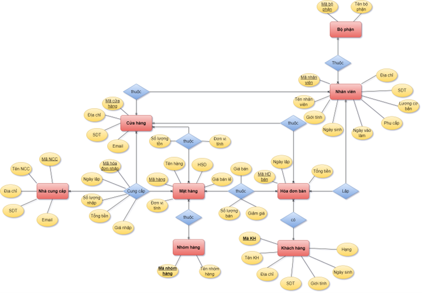
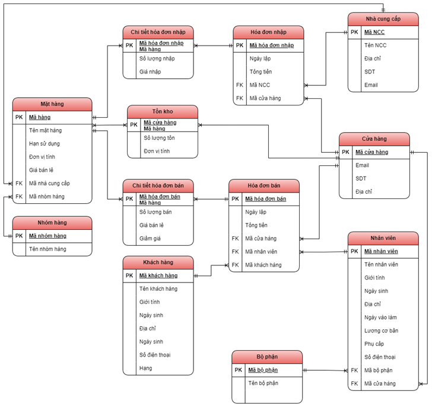
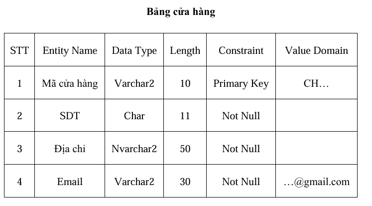

# 🏬 Hệ thống Quản lý Siêu thị – Oracle

Dự án mô phỏng một hệ thống quản lý bán, nhập hàng cho siêu thị, sử dụng **Oracle SQL Developer** để thiết kế và triển khai cơ sở dữ liệu quan hệ chuẩn hóa, kết hợp với **PL/SQL** để xử lý logic nghiệp vụ, tự động hóa, phân quyền người dùng và đề xuất giải pháp sao lưu – phục hồi dữ liệu.

---

## 🎯 Mục tiêu dự án

- Xây dựng cơ sở dữ liệu quan hệ chuẩn hóa 3NF cho siêu thị
- Cài đặt các chức năng nghiệp vụ bằng PL/SQL (trigger, procedure, function)
- Thiết lập hệ thống phân quyền theo vai trò người dùng thực tế
- Đề xuất phương án sao lưu & phục hồi dữ liệu bằng RMAN

---

## 🔑 Các nội dung chính

### 📌 1. Thiết kế cơ sở dữ liệu
- Mô hình hóa từ khái niệm → logic → vật lý
- Thiết kế cơ sở dữ liệu mức khái niệm: xác định các thực thể và mối quan hệ giữa các thực thể và vẽ sơ đồ ERD
  📷 *Sơ đồ ER (Conceptual Model)*  
 
- Thiết kế cơ sở dữ liệu mức logic: Chuẩn hóa dữ liệu đến **chuẩn 3NF**, Xác định các **khóa chính – khóa ngoại**, Phân tích **ràng buộc toàn vẹn** và quan hệ nhiều – một giữa các bảng
  📷 *Mô hình dữ liệu logic (thuộc tính, khóa, quan hệ)*  
 
- Thiết kế cơ sở dữ liệu mức vật lý: - Thiết kế mức vật lý: xác định kiểu dữ liệu cho các thuộc tính, thiết lập khóa chính, khóa ngoại, ràng buộc, tạo chỉ mục, sequence tự tăng và tối ưu lưu trữ cho Oracle.
 

### 📌 2. Thực hiện các chức năng quản lý bằng SQL & PL/SQL
#### 🧑‍💼 Quản lý nhân sự

- Cập nhật lương cơ bản theo phòng ban (`Nhân sự`: 15tr, `Bán hàng`: 8tr, `Kho hàng`: 14tr, `Tài chính`: 18tr)
- Cập nhật phụ cấp: làm trên 5 năm được 4tr, còn lại 1.5tr
- Thống kê số lượng nhân viên từng cửa hàng
- Truy vấn nhân viên bán hàng chưa từng bán được đơn hàng nào
- Tìm nhân viên bán được nhiều đơn hàng nhất
- Truy vấn thông tin chi tiết theo mã nhân viên hoặc mã cửa hàng
- Xóa nhân viên không hoạt động (bán hàng không bán được đơn nào)
- Viết procedure trả về danh sách nhân viên theo mã phòng ban

#### 🛒 Quản lý bán hàng

- Tính chiết khấu hóa đơn: thành viên giảm 10%, VIP giảm 15%, cập nhật lại tổng tiền
- Viết hàm tính tổng chi tiêu của 1 khách hàng
- Tạo trigger cập nhật hạng khách hàng tự động:
  - ≥ 10 triệu: hạng VIP
  - ≥ 5 triệu: hạng Thành viên

#### 📦 Quản lý sản phẩm

- Liệt kê các mặt hàng hết hạn sử dụng
- Thống kê số lượng mặt hàng theo nhóm hàng
- Truy vấn nhà cung cấp của từng mặt hàng
- Truy vấn mặt hàng theo mã để biết thuộc nhà cung cấp và nhóm hàng nào

#### 📊 Quản lý tồn kho

- Kiểm tra các mặt hàng sắp hết hàng tại cửa hàng
- Tạo trigger: không cho bán vượt quá số lượng tồn
- Trigger tự động cập nhật số lượng tồn sau mỗi giao dịch

#### 📈 Báo cáo & thống kê

- Top 10 mặt hàng bán chạy nhất
- Mặt hàng chưa từng được đặt mua
- Doanh thu tháng 1 của từng cửa hàng
- Tổng tiền hàng nhập tháng 8 của mỗi cửa hàng
- Vẽ biểu đồ doanh thu cửa hàng `CH01` theo tháng trong năm 2023

### 📌 3. Phân quyền người dùng

- Tài khoản giả lập: `QUANLY`, `THUNGAN`, `KETOAN`, `THUKHO`, `HR`
- Gán quyền SELECT/INSERT/UPDATE theo đúng vai trò
- Kiểm soát truy cập dữ liệu nhạy cảm

### 📌 4. Sao lưu & phục hồi dữ liệu

- Đề xuất sử dụng **RMAN** để sao lưu toàn bộ và gia tăng (incremental backup)
- Xuất dữ liệu dạng `.dmp` định kỳ
- Lên kế hoạch phục hồi trong các tình huống lỗi phần mềm/phần cứng

